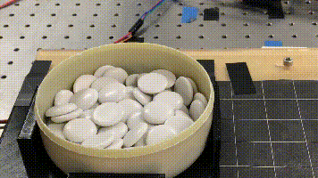
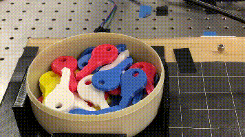

# Learned Scooping
## 1. Motivation
We have designed a model-based [scooping](https://github.com/HKUST-RML/Scooping) method via motion control with a minimalist hardware design: a two-fingered parallel-jaw gripper with a fixed-length finger and a variable-length thumb. When being executed in a bin scenario, instance segmentation using [**Mask R-CNN**](https://github.com/matterport/Mask_RCNN) and pose estimation using [**Open3D 0.7.0.0**](http://www.open3d.org/docs/0.7.0/getting_started.html) are needed. Also, the model analyzes one object on a flat surface, and cannot reflect complex interactions in a 3-D environment. For a heterogeneous cluster of unseen objects, it is difficult to apply the previous model-based method. Thus, we design a supervised hierarchical learning framework to predict the parameters of the scooping action directly from the RGB-D image of the bin scenario. Here are some video clips of the experiments.

<p align = "center">
   
   
   
 

</p>

## 2. Our learning framework
There are five parameters to be predicted: the finger position 𝑝, the horizontal distance between two fingers 𝑑, the ZYX Euler angle representation of the gripper orientation: yaw 𝛼, pitch 𝛽, and roll 𝛾. We design a hierarchical three-tier learning method. The input of the framework is the RGB-D image of the bin scenario. Tier 1 outputs the prediction of finger position 𝑝, and yaw 𝛼. Tier 2 predicts the distance 𝑑. Tier 3 predicts another two parameters: 𝛽 and 𝛾. See the following figure: 
<p align = "center">
   
</p>

## 3. Prerequisites
### 3.1 Hardware
- [**Universal Robot UR10**](https://www.universal-robots.com/products/ur10-robot/)
- [**Robotiq 140mm Adaptive parallel-jaw gripper**](https://robotiq.com/products/2f85-140-adaptive-robot-gripper)
- [**RealSense Camera L515**](https://github.com/IntelRealSense/realsense-ros)
- [**Customized Gripper design**](https://github.com/HKUST-RML/scooping/tree/master/Gripper%20design) comprises a variable-length thumb and a dual-material finger, for realizing finger length difference during scooping and dual material fingertip for the combination of dig-grasping and scooping.
<!-- - [**Customized Finger design**](https://github.com/HKUST-RML/dig-grasping/tree/master/fingertip%20design) features fingertip concavity---
- [**Extendable Finger**](https://github.com/HKUST-RML/extendable_finger) for realizing finger length differences during digging -->


### 3.2 Software
This implementation requires the following dependencies (tested on Ubuntu 16.04 LTS):
- [**ROS Kinetic**](http://wiki.ros.org/ROS/Installation)
- [**Urx**](https://github.com/SintefManufacturing/python-urx) for UR10 robot control
- [**robotiq_2finger_grippers**](https://github.com/chjohnkim/robotiq_2finger_grippers.git): ROS driver for Robotiq Adaptive Grippers
- [**pySerial**](https://github.com/pyserial/pyserial) for accessing arduino through serial connection and control the extendable finger.
- [**PyBullet**](https://pybullet.org/wordpress/) for collision check
- [**PyTorch**](https://pytorch.org/) for constructing and training the network
- [**pyrealsense2**](https://github.com/IntelRealSense/librealsense/tree/master/wrappers/python): A python wrapper for realsense camera.

## 4. Making Heightmap and Annotating Software

### 1. Make Heightmap
We use a Realsense L515 camera to get the RGB image and the depth image. Then, we combine the RGB image and the depth image to make the RGB-D heightmap. A heightmap is an RGB-D image obtained from a 3D point cloud, describing the 3D information of the bin scenario. Each pixel in the heightmap is in linear relation to its horizontal position in the world frame and corresponds to a value indicating the height-from-bottom information. 
```
python utils/heightmap.py
```

Here is the set of heightmaps describing the cluster of Go stones, domino blockes, Acrylic borads: [**image set**](https://drive.google.com/file/d/16ZRlpwpydlClJe8BO14yqvpfjpRSPi6Z/view?usp=sharing)

### 2. Annotating Software
I also write an annotating software to label the data. 
- `learned_scooping/annotating_software/label_Tier1.py` is for Tier 1, where the pixel where should (not) be the target finger position should be labeled green (red). You can choose the shape and size of the brush.
- `learned_scooping/annotating_software/label_Tier2.py` is for Tier 2. We need to label the target thumb position given the target finger position.

## 5. Training the Network
- Train Tier 1: `learned_scooping/training_program/training_tier1.ipynb`
- Train Tier 2: `learned_scooping/training_program/training_tier2.ipynb`
- Train Tier 3: `learned_scooping/training_program/training_tier3.ipynb`

**Note**: The online compiler [**Jupyter Notebook**](https://jupyter.org/) is needed to run our program.

## 6. Network Parameters
- Network parameters for Tier 1: [**netparam_Tier1.pkl**](https://drive.google.com/file/d/1VOIXfqVoNxwKSW5DBbMA_HiNmP9dOBLd/view?usp=sharing)
- Network parameters for Tier 2: [**netparam_Tier2.pkl**](https://drive.google.com/file/d/1WtL7sQy0A652arjwMEe4Qs3RpkObTl3j/view?usp=sharing)
- Network parameters for Tier 3: [**netparam_Tier3.pkl**](https://drive.google.com/file/d/1e4cDDbj0rh-cjz0KHTtU_HtDcCwiDG7q/view?usp=sharing)

## 7. Test on Real UR10 Robot:
Please run the following program: `learned_scooping/test_on_real_robot.py`

This can be successfully applied to the cluster of Go stones, domino blockes, Acrylic borads and key-shape 3D-printed models.
## Maintenance 
For any technical issues, please contact: Tierui He (theae@connect.ust.hk).


